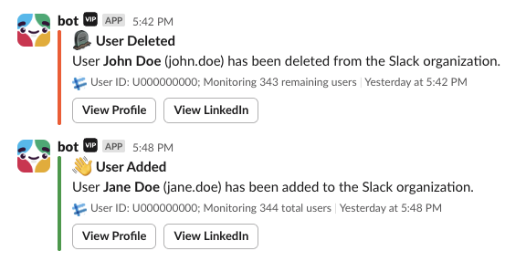

# Slackbot

Utilities for the workplace.

## Features

See example [config.yaml](./cmd/bot/config.yaml) or environment variables in [flag.go](./bot/config/flag.go) for feature configuration. Updates to this file will update the runtime configuration while it's running.

- Obituaries/User watch to get notified when users are added or removed from the Slack org (scopes: `channels:history`, `groups:history` and `chat:write`.)
- Chat responses and reactions, requires `SLACK_SIGNING_SECRET`, configured responses, and a public event endpoint.
- Vibecheck: check the vibe
- AI Chat with different prompted, unhinged, sticky (assigned to users at random for 1 hour) personas, requires `SLACK_SIGNING_SECRET`, `OPENAI_API_KEY` and configuring a public event endpoint.

## Setup

Create a Slack app: From "OAuth & Permissions" in the app's menu, you can "Install to workspace" and then get a "Bot User OAuth Token" which is the Slack token used in this service. Add necessary scopes per feature.

Manage the app via the CLI, run with `--help` to see options and valid environment variables. Requires `SLACK_TOKEN` or `SLACK_TOKEN_FILE`.
