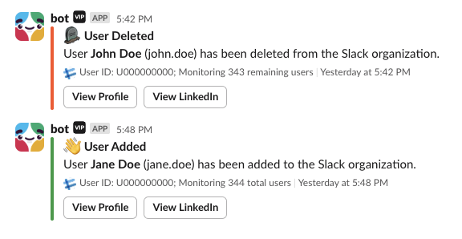

# Slackbot

[](https://github.com/brettinternet/slackbot/actions/workflows/ci.yml)
[](https://github.com/brettinternet/slackbot/actions/workflows/publish-bot.yaml)

Workplace utilities for Slack.



## Features

- Notify a channel when workspace users are added, deactivated, or removed.
- Reply or react to configured message patterns.
- Run vibechecks and temporarily remove users who fail.
- Answer messages with OpenAI-backed, rotating personas and recent conversation context.
- Post an AI-generated shower thought during configured weekday hours.
- Send messages, invite users, or delete bot messages from the CLI.
- Expose health checks at `/health`, `/healthz`, and `/ready`.
- Optionally expose Prometheus operational metrics.

## Setup

Requirements: Go 1.26 and [Task](https://taskfile.dev/). [mise](https://mise.jdx.dev/) can install the local toolchain.

```sh
task init # creates .env from example.env when absent
```

Edit `.env` and `config.yaml`, then start the bot:

```sh
task start
```

The bot requires `SLACK_TOKEN`. User monitoring is optional; enable it with a Slack conversation ID
such as `C0123456789` or `G0123456789` in `SLACK_USER_NOTIFY_CHANNEL` or `user.notify_channel`.
Grant `users:read`, `channels:read`, `groups:read`, and `chat:write`, and invite the bot to the destination.

For message, vibecheck, and AI chat events:

1. Set `SLACK_SIGNING_SECRET`.
2. Expose `POST /api/slack/events` publicly.
3. Set that URL under **Event Subscriptions** in the Slack app.
4. Subscribe to `app_mention` and the message events needed for your channels.

Add bot token scopes for the features you enable. Typical scopes include `users:read`, `chat:write`,
`reactions:write`, `app_mentions:read`, and channel history. Vibecheck and invite commands also need
permission to manage channel membership.

## Configuration

`config.yaml` contains complete examples for chat responses, vibecheck, AI personas, context limits,
and shower thoughts. Environment variables and CLI flags provide credentials and runtime settings:

```sh
task bot:run -- --help
```

Useful settings:

| Setting                            | Default             | Purpose                            |
| ---------------------------------- | ------------------- | ---------------------------------- |
| `CONFIG_FILE`                      | `./config.yaml`     | YAML or JSON feature configuration |
| `DATA_DIR`                         | `./`                | SQLite and user-state storage      |
| `SERVER_PORT`                      | `4200`              | HTTP port                          |
| `SLACK_EVENTS_PATH`                | `/api/slack/events` | Slack Events API path              |
| `SLACK_EVENT_DEDUPLICATION_WINDOW` | `5m`                | Slack event retry retention window |
| `OPENAI_MODEL`                     | application default | AI model                           |
| `OPENAI_REASONING_EFFORT`          | application default | Model reasoning effort             |
| `METRICS_ENABLED`                  | `false`             | Expose Prometheus metrics          |
| `METRICS_PATH`                     | `/metrics`          | Prometheus endpoint path           |

The Slack Events endpoint accepts only `POST` requests and limits request bodies to 1 MiB. Slack
signature verification uses the original request bytes before JSON parsing. Each registered event
processor has an independent single-worker, 100-event dispatch queue, so its event concurrency is
bounded at one. The endpoint acknowledges valid events without waiting for processors; when a
processor's queue is full, its newest event is dropped and the overflow is logged without message
content. Processor errors and panics are logged and isolated from every other processor. Events with
the same Slack `event_id` are acknowledged but dispatched only once during the configured retention
window. The cache retains at most 10,000 IDs; events without a
usable ID are dispatched normally. Graceful shutdown drains processor queues until the shutdown
deadline and logs any work that remains.

Operational logs identify the component and operation for event-processing failures. Slack callback
logs carry the event ID as `correlation_id` from receipt through feature processing when Slack provides
one. Message bodies and prompts are not logged; fields named for common secrets or sensitive payloads,
including errors that may embed upstream response bodies, are redacted by the application logger.

Prometheus metrics are disabled by default. Enable them with `metrics.enabled: true` in `config.yaml`
or `METRICS_ENABLED=true`; use `metrics.path` or `METRICS_PATH` to change the endpoint. Metrics cover
HTTP outcomes, Slack retry deduplication, processor queue depth and overflow, Slack/OpenAI latency and
errors, OpenAI token usage when reported by the API, and vibecheck outcomes. Labels contain only
bounded operation, processor, status, and outcome values—never IDs, messages, or prompts. Metrics are
in-process and do not require or affect a Prometheus server, health, or readiness.

`/ready` returns `503` until initial configuration, Slack authentication, configured feature workers,
and the HTTP listener have started. These are the required dependencies for the selected
configuration. Optional user monitoring, AI chat, and shower thoughts are not readiness prerequisites
when disabled; the vibecheck maintenance worker still starts while new vibechecks are disabled so
existing bans can expire. Readiness changes to `503` immediately when shutdown begins. `/health` and
`/healthz` report process health separately.

The configuration file is watched and valid updates are applied in order. Invalid YAML, invalid AI
context limits, invalid shower-thought hours, and invalid deduplication windows are rejected; the last
valid configuration remains active.

| Reload behavior       | Settings                                                                                                                                                                        |
| --------------------- | ------------------------------------------------------------------------------------------------------------------------------------------------------------------------------- |
| Applied while running | `user.notify_channel`, `chat.*`, `vibecheck.*`, `aichat.*` (including personas and enable/disable), and `showerthought.*` (including enable/disable and hours)                  |
| Restart required      | Log level/environment, data/config paths, HTTP port/event path/deduplication window, metrics settings, Slack credentials/preferences, and OpenAI API key/model/reasoning effort |

Environment variables and CLI flags are read only at startup. A config-file update that changes a
restart-required setting emits one warning naming every such setting. AI chat and shower thoughts can
be enabled at runtime only when the process started with an OpenAI API key; shower thoughts also need
a non-empty `user.notify_channel`.

### AI conversation privacy

AI chat persists the user's Slack ID, channel or thread scope, selected persona name, message text,
message role, and timestamp in `DATA_DIR/aichat_context.db`. Live Slack history fetched for a response
is not copied into this database. `aichat.max_context_age` controls both the oldest persisted message
eligible for a response and its retention period (default `2h`). Expired messages are removed at
startup and hourly thereafter. Persona assignments are retained for `aichat.sticky_duration`; expired
assignments are removed by the same cleanup. Both settings apply to a running process after a valid
configuration reload. On startup, ordered SQLite migrations upgrade databases created by older
releases in one transaction and record applied versions in `schema_migrations`. Startup fails with
the migration version and name if an upgrade cannot complete; existing conversation and persona data
is left unchanged.

Operators can delete one exact conversation scope, including its persisted persona assignment:

```sh
slackbot clear-ai-context --scope C0123456789
slackbot clear-ai-context --scope 'C0123456789:thread:1712345678.000100'
```

A channel scope does not delete its thread scopes, and clearing a thread does not delete channel
history. The command reports record counts without logging stored message content.

## Container

```yaml
services:
  slackbot:
    image: ghcr.io/brettinternet/slackbot:main
    ports:
      - "4200:4200"
    environment:
      CONFIG_FILE: /app/config.yaml
      DATA_DIR: /app/data
      SLACK_TOKEN: "${SLACK_TOKEN}"
      SLACK_SIGNING_SECRET: "${SLACK_SIGNING_SECRET}"
      SLACK_USER_NOTIFY_CHANNEL: C0123456789
      OPENAI_API_KEY: "${OPENAI_API_KEY}"
    volumes:
      - ./config.yaml:/app/config.yaml:ro
      - ./data:/app/data
```

Docker secrets are also read from `/run/secrets/slack_token`,
`/run/secrets/slack_signing_secret`, and `/run/secrets/openai_api_key`.

## CLI examples

```sh
# Send to one channel
task bot:run -- send-message --message "Hello" --channels C01234567

# Invite users to channels
task bot:run -- invite-channel --users U01234567 --channels C01234567

# Delete messages posted by bots in a channel
task bot:run -- delete-messages-from-channel --channel C01234567
```

## Development

```sh
task test   # tests
task check  # lint and security checks
task fix    # formatting and automatic fixes
task build  # build ./bin/bot
```
